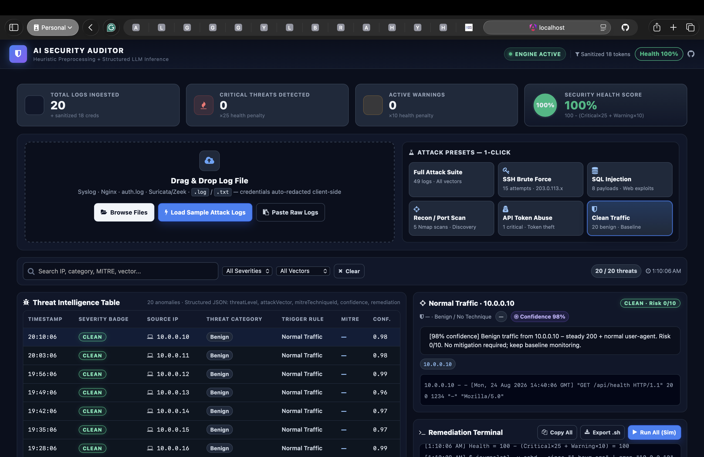
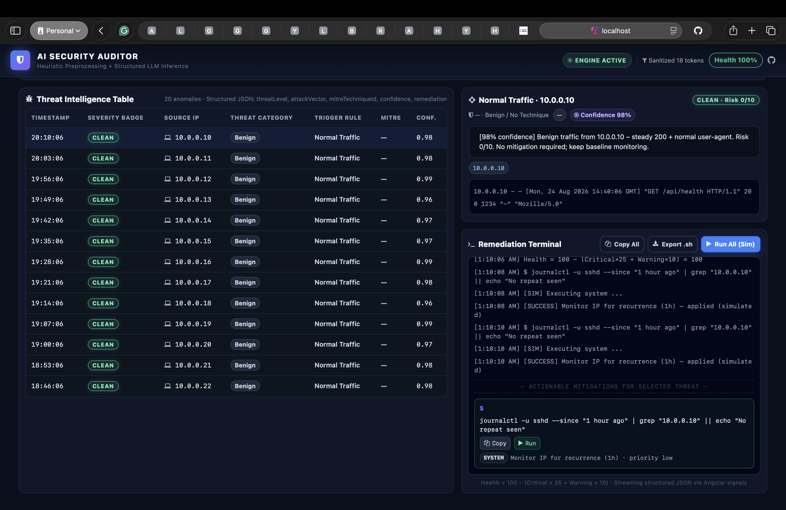

# AI Security Log Auditor

> Manual log triage takes 15+ minutes and misses stealthy bursts. This dashboard ingests raw Syslog/Nginx/auth.log/Suricata logs, redacts credentials client-side, clusters anomalies with lightweight heuristics, and streams structured threat JSON (threatLevel, attackVector, mitreTechniqueId, confidence, remediation) into an interactive cyber-terminal for instant iptables/fail2ban/nginx mitigations.

**Live Demo:** `https://ai-security-auditor-one.vercel.app` · **Video:** *(Unlisted YouTube link)* · **Blog:** *(Dev.to/Hashnode link)*





## Architecture

```mermaid
flowchart LR
  A[Raw Logs<br/>.log/.txt<br/>Syslog/Nginx/auth.log] --> B[Ingestion & Sanitization<br/>src/app/services/log-generator.service.ts:12<br/>Bearer/api_key/password → [REDACTED]<br/>regex: discard 90% 200s, cluster 401/403 & SSH invalid-user & SQLi]
  B --> C[Structured Prompt<br/>anomaly batch → JSON schema<br/>threatLevel, attackVector, mitreId, confidence, remediationCommands]
  C --> D[AI Inference<br/>Gemini 2.0 Flash / Ollama Llama 3.1 8B<br/>or local heuristic fallback<br/>src/app/services/ai-auditor.service.ts:1]
  D --> E[Risk & Remediation Engine<br/>Health = 100 - (Critical×25 + Warning×10)<br/>iptables / fail2ban-client / ufw / nginx]
  E --> F[Angular Signals<br/>src/app/components/dashboard/dashboard.component.ts:1<br/>metrics, threat table, inspector, terminal]
  F --> G[Dark Cyber UI<br/>#0a0f1d / #1e293b / glowing badges]
```

**Pipeline highlight file mapping:**
* `src/app/models/security.model.ts:1` — `LogEntry`, `ThreatReport`, `MitreTechnique`, `RemediationAction`, `DashboardMetrics`
* `src/app/services/log-generator.service.ts:32` — `getAttackPresets()` / `getSampleLogsByPreset()` / `parseRawLogLines()`
* `src/app/services/ai-auditor.service.ts:18` — `ingestLogs()` → `mitreMap` (`T1110.001`, `T1190`, `T1046`, `T1078`) + `buildRemediation()`
* `src/app/components/dashboard/dashboard.component.html:20` — metric bar, `src/app/components/dashboard/dashboard.component.html:32` drag-drop zone `(dragover)/(drop)`, `src/app/components/dashboard/dashboard.component.html:145` remediation terminal

## Tech Stack

| Layer | Choice | Why |
|---|---|---|
| Frontend | Angular 17+ standalone, TypeScript, `CommonModule` + `FormsModule` | Reactive signals/services, strict types |
| Styling | Bootstrap 5.3 + SCSS (`src/app/app.scss:1`, `src/app/components/dashboard/dashboard.component.scss:1`) | Terminal dark theme `#0a0f1d`, `#1e293b` cards, glowing badges |
| Icons | Font Awesome 4.7 (`angular.json:36`) | `fa-shield`, `fa-terminal`, `fa-bug` |
| AI | Gemini 2.0 Flash (cloud) / Ollama Llama 3.1 8B local | Spec schema: `threatLevel`/`attackVector`/`mitreTechniqueId`/`confidenceScore`/`remediationCommands` — fallback heuristic already ships |
| Build | Angular CLI `ng build` / `ng test` (Vitest) | `angular.json:43` budgets `700kB/14kB` |

Recommended models per spec: **Gemini 2.0 Flash** (1M context, sub-second) for hosted; **Ollama (Qwen 2.5 Coder)** for air-gapped — logs never leave browser.

## Features

* **Ingestion:** drag-drop, browse, 6 presets (Full 49 / SSH 15 / SQLi 8 / Recon 5 / API 1 / Clean 20), paste raw text — all via `src/app/components/dashboard/dashboard.component.ts:55` `onDragOver/onDrop/handleFile`
* **Sanitization:** client-side redaction before any AI call (`sanitizedTokensCount` in header)
* **Metrics:** Total Ingested / Critical / Warning / Health `100-(C×25+W×10)` with conic ring `healthColor()`
* **Threat Intel:** filterable table (search IP/vector/MITRE, severity & vector dropdown) — selectable row opens inspector with `aiAnalysis`, MITRE link, IoCs, raw redacted line
* **Terminal:** per-threat `iptables`/`fail2ban`/`ufw`/`nginx` with **Copy**, **Run (Sim)**, **Copy All**, **Export .sh** (`downloadScript()`), simulated stdout

## Quick Start

```bash
# prerequisites: Node 20+, npm 10+
git clone https://github.com/prabanjan127/ai-security-auditor.git
cd ai-security-auditor
npm install          # installs bootstrap@5.3.8 + font-awesome@4.7.0 per angular.json:33
ng serve             # http://localhost:4200 — dashboard auto-loads Full Attack Suite
ng test              # 2/2 passing (src/app/app.spec.ts:1)
npm run build        # → dist/ai-security-auditor/browser/
```

**Try it:**
1. Click **Load Sample Attack Logs** or any preset pill.
2. Or drop a `.log` (e.g. `auth.log` with `Failed password for invalid user admin from 203.0.113.5`).
3. Filter by `CRITICAL`, search `203.0.113`, select a row → copy `sudo iptables -A INPUT -s 203.0.113.5 -p tcp --dport 22 -j DROP` from terminal.

## Deploy

### Vercel (recommended)
```bash
npm i -g vercel
vercel --prod  # uses vercel.json (output: dist/ai-security-auditor/browser)
```
`vercel.json` already contains SPA rewrite `/(.*) → /index.html`.

### Netlify / GitHub Pages
```bash
npm run build
# Netlify: drag dist/ai-security-auditor/browser
# GH Pages: npx angular-cli-ghpages --dir=dist/ai-security-auditor/browser
```

## Project Links (replace before submit)

* **GitHub:** `https://github.com/prabanjan127/ai-security-auditor`
* **Live Demo:** `https://ai-security-auditor-one.vercel.app`
* **Blog (Dev.to/Hashnode):** paste draft from prompt + screenshots above
* **Video (Unlisted YouTube):** 0:00 problem / 0:30 upload demo / 1:30 architecture

## How It Works (for blog/video)

1. **Ingest** — drop `.log` → `LogGeneratorService.parseRawLogLines()` clusters anomalies.
2. **Sanitize** — `sanitizeLine()` redacts `Bearer`/`api_key` before inference.
3. **Infer** — structured prompt expects `{threatLevel, attackVector, mitreTechniqueId, confidenceScore, remediationCommands}`.
4. **Score** — `calculateDashboardMetrics()` → health.
5. **Display** — `DashboardComponent` binds via `applyFilters()` / `selectReport()`; terminal streams `terminalOutput[]`.

## License

MIT — showcase project; not for production firewall automation without review.
